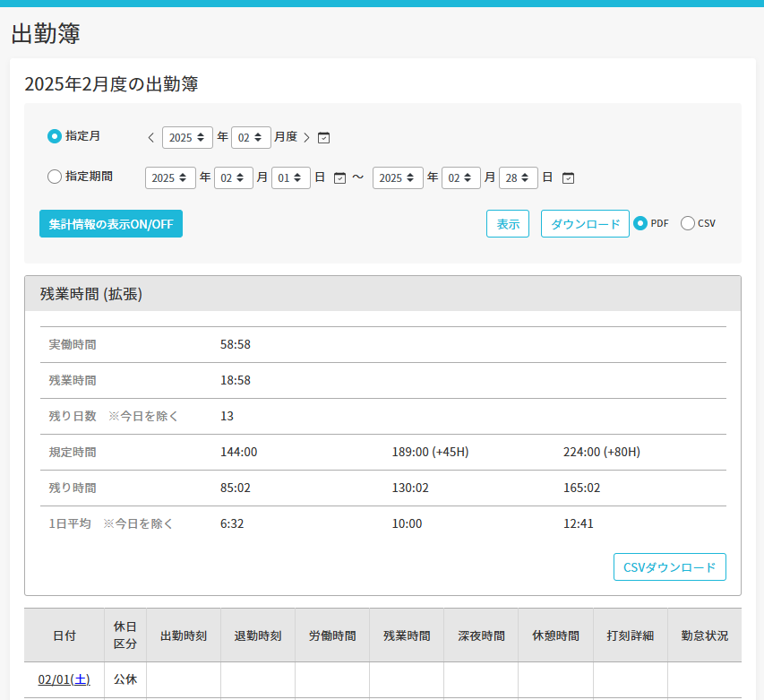

# Jobcan Overwork Counter

主に自分用 
Jobcan の出勤簿に、残業45H or 80H超過までの残り時間や、残りの勤務日の1日あたりの稼働可能時間を計算して表示します

## Install

1. github から git clone か Download Zip でソースコードをダウンロードする
2. Chromeを起動して chrome://extensions/ にアクセスする
3. 左上の「デベロッパーモード」をONにする
    

4. 右上の「パッケージ化されていない拡張機能を読み込む」を押す
    

5. 1.でダウンロードしたフォルダ(jobcan-calc)を選択する
    

6. Jobcanで出勤簿を開いて、出勤簿の上に「残業情報」カードが表示されれば完了です
    

---
2025.1 yudai.yamazaki
